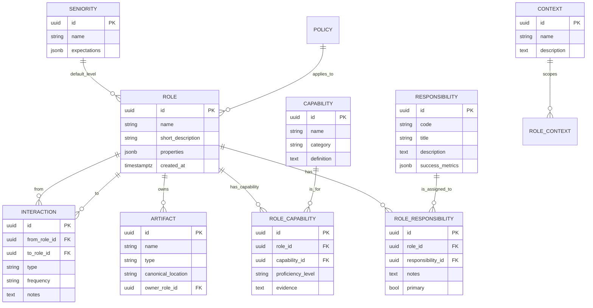

# 1 — Modeling goals (brief)

* Represent **roles** as first-class conceptual entities (not persons).
* Capture **responsibilities**, **capabilities/skills**, **artifacts** they own, **interaction patterns**, and **seniority**.
* Make model useful for documentation, automation (agents), visualization, and career conversations.
* Allow both structured queries (SQL) and flexible metadata (JSONB).

---

# 2 — Core entities & purpose

1. **Role** — conceptual professional identity (Data Engineer, Backend Engineer, PM).
2. **Responsibility** — discrete domain responsibilities (e.g., “data pipeline design”, “API reliability”).
3. **Capability / Skill** — competency items with proficiency levels (e.g., Spark, System Design).
4. **Artifact** — things produced/owned (dashboard, pipeline, API spec, roadmap).
5. **Activity Pattern** — common workflows (handoff, code review, postmortem).
6. **Interaction** — typed link between roles (owns, depends\_on, collaborates\_with, advises).
7. **SeniorityLevel** — junior → staff → principal with descriptors.
8. **Context / Domain** — product area or domain (billing, recommendations) — useful to scope role variants.
9. **Policy / SLA** — cross-cutting rules (release cadence, uptime SLAs).
10. **Event / ChangeLog** — historical record (role changes, artifact ownership changes).

---

# 3 — Key attributes (selected)

Role

* id, name, short\_description, mission\_statement, scope, default\_seniority\_id, properties (jsonb), created\_at

Responsibility

* id, code, title, description, risk\_level, success\_metrics (jsonb)

Capability

* id, name, category, definition, assessment\_guidelines

Artifact

* id, name, type, description, canonical\_location (URL/path), owner\_role\_id, lifecycle\_state

Interaction (join)

* id, from\_role\_id, to\_role\_id, type, frequency, notes

SeniorityLevel

* id, name, expectations, impact\_scope, example\_tasks, promotion\_criteria

ActivityPattern

* id, name, trigger, outcome, participants (jsonb)

Policy

* id, name, scope, rule (jsonb), enforcement

Event / ChangeLog

* id, entity\_type, entity\_id, change\_type, payload (jsonb), timestamp, actor

---

# 4 — Relationship rules (cardinality / semantics)

* Role ↔ Responsibility: many-to-many (a role can have multiple responsibilities; a responsibility may span roles).
* Role ↔ Capability: many-to-many with proficiency (level) and endorsements.
* Role ↔ Artifact: one-to-many (role owns zero-or-more artifacts), but artifact owners can be multiple via ownership table.
* Role ↔ Role (Interaction): many-to-many, typed (collaborates\_with, depends\_on, escalates\_to).
* Role ↔ SeniorityLevel: many-to-one (a role has a default/typical seniority, but role instances for people may vary).
* Context scopes roles/responsibilities (optional): many-to-many.

---

# 5 — Mermaid ER (paste into mermaid.live or Markdown renderers that support Mermaid)



---

# 6 — PostgreSQL-style DDL (practical)

```sql
CREATE EXTENSION IF NOT EXISTS "uuid-ossp";

CREATE TABLE role (
  id uuid PRIMARY KEY DEFAULT uuid_generate_v4(),
  name text NOT NULL,
  short_description text,
  mission text,
  scope text,
  default_seniority uuid REFERENCES seniority(id),
  properties jsonb DEFAULT '{}'::jsonb,
  created_at timestamptz DEFAULT now()
);

CREATE TABLE responsibility (
  id uuid PRIMARY KEY DEFAULT uuid_generate_v4(),
  code text UNIQUE,
  title text NOT NULL,
  description text,
  success_metrics jsonb DEFAULT '{}'::jsonb
);

CREATE TABLE role_responsibility (
  id uuid PRIMARY KEY DEFAULT uuid_generate_v4(),
  role_id uuid NOT NULL REFERENCES role(id) ON DELETE CASCADE,
  responsibility_id uuid NOT NULL REFERENCES responsibility(id) ON DELETE CASCADE,
  primary_flag boolean DEFAULT false,
  notes text,
  UNIQUE (role_id, responsibility_id)
);

CREATE TABLE capability (
  id uuid PRIMARY KEY DEFAULT uuid_generate_v4(),
  name text NOT NULL UNIQUE,
  category text,
  definition text
);

CREATE TABLE role_capability (
  id uuid PRIMARY KEY DEFAULT uuid_generate_v4(),
  role_id uuid NOT NULL REFERENCES role(id) ON DELETE CASCADE,
  capability_id uuid NOT NULL REFERENCES capability(id) ON DELETE CASCADE,
  proficiency text, -- e.g. novice|intermediate|advanced|expert
  evidence jsonb DEFAULT '{}'::jsonb,
  UNIQUE (role_id, capability_id)
);

CREATE TABLE artifact (
  id uuid PRIMARY KEY DEFAULT uuid_generate_v4(),
  name text NOT NULL,
  type text,
  description text,
  canonical_location text,
  owner_role_id uuid REFERENCES role(id)
);

CREATE TABLE interaction (
  id uuid PRIMARY KEY DEFAULT uuid_generate_v4(),
  from_role_id uuid NOT NULL REFERENCES role(id),
  to_role_id uuid NOT NULL REFERENCES role(id),
  type text NOT NULL, -- owns|depends_on|collaborates_with|escalates_to
  frequency text, -- daily|weekly|on_release
  notes text,
  UNIQUE (from_role_id, to_role_id, type)
);

CREATE TABLE seniority (
  id uuid PRIMARY KEY DEFAULT uuid_generate_v4(),
  name text NOT NULL UNIQUE, -- Junior, Mid, Senior, Staff, Principal
  expectations jsonb DEFAULT '{}'::jsonb
);

CREATE TABLE context (
  id uuid PRIMARY KEY DEFAULT uuid_generate_v4(),
  name text NOT NULL,
  description text
);

-- simple audit/event log
CREATE TABLE event_log (
  id uuid PRIMARY KEY DEFAULT uuid_generate_v4(),
  entity_type text NOT NULL,
  entity_id uuid,
  change_type text NOT NULL,
  payload jsonb,
  actor text,
  created_at timestamptz DEFAULT now()
);
```

(You can extend with `role_context`, `policy`, etc.)

---

# 7 — Example seed rows (semantic examples)

Role: Data Engineer

* mission: “Reliable, observable, and cost-efficient pipelines delivering clean curated data.”
* properties: {workstyle: \["infrastructure-first","idempotent"], preferred\_tech: \["airflow","dbt","kafka"]}

Responsibility: Data Pipeline Design

* success\_metrics: {"latency":"<1h","freshness":"99.9% on-time","data\_loss":"0"}

Capability: Distributed Systems Design

* category: "systems"

Interaction example:

* from: Data Engineer → to: Data Analyst, type: "delivers\_dataset", frequency: "daily" (notes: SLAs and field contracts)

Seniority example:

* Senior: expectations include “system-level design ownership, mentoring, code review guardrails, cross-team influence”

---

# 8 — Folder structure mapping (how to store one “agentic profile” per folder)

Each role folder = canonical profile + artifacts + templates:

```
/crew/
  /data-engineer/
    profile.md            # mission, scope, responsibilities (human-readable)
    profile.yaml          # structured metadata matching DB model (role + properties)
    responsibilities/
      data-pipeline.md
      data-quality.md
    capabilities/
      distributed-systems.md
      dbt.md
    artifacts/
      pipelines.md
      ownership_list.csv
    templates/
      onboarding-checklist.md
      runbook-template.md
```

`profile.yaml` example (reduces friction for automated provisioning):

```yaml
id: de-01
name: Data Engineer
mission: "Reliable, observable pipelines..."
default_seniority: Senior
properties:
  preferred_tech: ["airflow","dbt"]
  working_model: "platform-first"
responsibilities:
  - data-pipeline-design
  - data-quality
capabilities:
  - distributed-systems
  - sql
```

Benefits: docs + machine-readable metadata allows agents to ingest role context easily.

---

# 9 — Seniority & competency mapping (practical)

Model proficiency separately from seniority:

* `role_capability.proficiency` = skill level on that capability (novice, competent, advanced, expert).
* `seniority.expectations` = what impact/ownership looks like at that level.
* Use this to drive prompts like: “Given role X at seniority Y produce onboarding checklist” — agent can read structured YAML.

Promotion criteria example (jsonb):

```json
{
  "impact": "owns cross-team pipelines",
  "mentorship": "mentors 2+ engineers",
  "system_design": "leads at least 1 major redesign"
}
```

---

# 10 — Useful example queries (ideas)

* “Which roles own artifacts of type `pipeline`?” → `SELECT r.name FROM role r JOIN artifact a ON a.owner_role_id = r.id WHERE a.type='pipeline'`.
* “Who depends on Data Engineer?” → `SELECT from_role, to_role, type FROM interaction ...`
* Graph traversal (who influences who) — use recursive CTE or export to a graph DB for visualization.

---

# 11 — Implementation choices & trade-offs (quick)

* **Relational + JSONB**: good for structured queries + flexible metadata. Recommended for governance, audits, and reporting.
* **Graph DB** (Neo4j/JanusGraph): shines if you need deep role-interaction analysis and path queries (influence chains).
* **Docs (Markdown + YAML)**: simplest for human-first workflow; pair with automated ingestion to populate DB. Good for small orgs or rapidly changing definitions.
